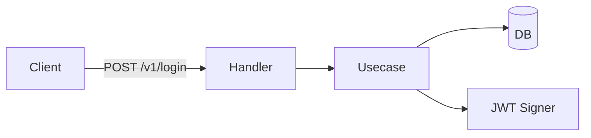

## Project Overrides

실행 전에 아래 경로의 프로젝트 로컬 오버라이드 파일을 Read로 확인한다:

- `.claude/common/common.md` — 플러그인 공통 (모든 스킬에 적용)
- `.claude/common/skills/doc-gen.md` — 본 스킬 전용

존재하면 내용을 **추가 규칙/예외/변경점**으로 흡수해 본 스킬 흐름에 반영한다. 충돌 시 프로젝트 오버라이드가 우선. 상세 규약: 플러그인 루트 `OVERRIDES.md`.

---

# /common:doc-gen — 단일 파일 문서 생성

지정한 범위 내의 코드/변경사항을 요약하고, 그래프와 인터랙션이 포함된 **단일 파일** 문서를 만든다.

## 핵심 철학

- **단일 파일 보장**: 외부 자산 없이 그 파일 하나로 열어볼 수 있어야 한다.
- **읽기 위한 문서**: 코드를 그대로 옮기지 않고, 구조·흐름·관계를 시각화한다.
- **범위 우선**: 어디까지 다룰지를 먼저 확정한 뒤 정리한다.
- **요약은 사실 기반**: 코드/diff에서 직접 확인한 것만 적는다. 추측은 `[Assumption]` 표기.

---

## Phase 0: 인자 파싱

`$ARGUMENTS` 를 `-md` / `-html` 플래그와 나머지(범위 후보)로 분리한다.

| 토큰 | 의미 |
|------|------|
| `-md`, `--md`, `md` | 출력 포맷: Markdown |
| `-html`, `--html`, `html` | 출력 포맷: HTML |
| 그 외 | 범위 후보로 보존 (Phase 1 으로 전달) |

규칙:
1. 플래그가 둘 다 있으면 마지막에 등장한 것을 사용.
2. 플래그가 없으면 `AskUserQuestion` 으로 한 번 묻는다 (옵션: md / html).
3. 범위 후보가 비어 있으면 Phase 1 의 단계적 질문으로 진행, 있으면 그 값을 디폴트 후보로 들고 Phase 1 의 확인만 받는다.

---

## Phase 1: 범위 확정 (단계적 질문)

`AskUserQuestion` 을 사용해 한 번에 하나씩 물어가며 범위를 확정한다. 절대 추측해서 진행하지 않는다.

### Step 1 — 범위 종류

```
어떤 범위를 정리할까요?

1. 파일 / 디렉토리 / glob
2. 최근 변경(working tree, staged 포함)
3. Commit range (예: HEAD~5..HEAD, 또는 특정 SHA 범위)
4. PR (GitHub PR 번호)
```

> 인자로 들어온 후보가 있으면 1~4 중 하나로 자동 분류해서 "이게 맞나요?" 만 확인한다.

### Step 2 — 종류별 세부값

선택된 종류에 따라 하나만 더 묻는다.

- **파일/디렉토리/glob**: "정리할 경로 또는 glob 을 알려주세요. (예: `src/auth`, `internal/**/*.go`, `app/page.tsx`)"
- **최근 변경**: 추가 질문 없이 `git status` + `git diff` 로 수집.
- **Commit range**: "범위를 알려주세요. (예: `HEAD~5..HEAD`, `main..feature/x`)"
- **PR**: "PR 번호를 알려주세요. (예: `42`)" → `gh pr view <num>` + `gh pr diff <num>` 로 수집. `gh` 미설치/미인증이면 사용자에게 알리고 commit range 모드로 fallback 제안.

### Step 3 — 문서의 초점

```
이 문서의 초점은 무엇인가요?

1. 아키텍처 / 구성요소 관계 — 모듈/계층/의존성 시각화 중심
2. 흐름 / 시퀀스 — 요청 흐름, 함수 호출 순서, 상태 전이 중심
3. 변경 요약 (review 용) — diff 요약, 영향 범위, 핵심 포인트 중심
4. API 명세 — 엔드포인트, 입출력, 에러 케이스 중심
```

복수 선택 가능. 디폴트는 (1+2).

### Step 4 — 출력 파일 경로

```
출력 파일 경로를 지정할까요? (엔터/스킵 시 기본값)
```

기본값 규칙:
- md: `./docs/doc-gen-<unix-timestamp>.md`
- html: `./docs/doc-gen-<unix-timestamp>.html`

`./docs/` 가 없으면 `Bash` 로 생성한다. 사용자가 다른 경로를 지정하면 그대로 사용.

---

## Phase 2: 범위 분석

확정된 범위에서 정보를 수집한다.

### 도구 매핑

| 범위 종류 | 수집 명령 |
|----------|----------|
| 파일/디렉토리/glob | `Glob` 으로 파일 목록 → `Read` 로 내용 |
| 최근 변경 | `git status -s`, `git diff`, `git diff --staged` (Bash) |
| Commit range | `git log --oneline <range>`, `git diff <range>` (Bash) |
| PR | `gh pr view <n> --json title,body,headRefName,baseRefName,files`, `gh pr diff <n>` (Bash) |

### 구조 추출

수집 결과에서 아래를 추출한다 (해당 시).

- 파일 단위: 경로, 역할(헤더/네임스페이스/패키지/`package`/`module` 선언으로 추정), 핵심 export.
- 호출/의존: import / require / `from X import Y` / Go import 그래프.
- 진입점: `main`, route 정의, handler 등록, page 컴포넌트 등 프로젝트 컨벤션 기준으로 식별.
- 변경 요약: 추가/삭제/수정 파일 카운트, 핵심 hunk 의 의미.
- (API 초점일 때) HTTP method + path + request/response 필드.

추출은 코드에 직접 보이는 사실만. 추측이 필요하면 `[Assumption]` 으로 표기.

---

## Phase 3: 단일 파일 출력 생성

출력 포맷에 따라 파일을 생성한다. 두 포맷 모두 **외부 빌드 단계 없이 그 파일 하나로 열람 가능** 해야 한다.

### 공통 섹션 (양쪽 포맷 공통 골격)

1. **헤드라인** — 범위·생성일·초점
2. **요약 (TL;DR)** — 3~5줄
3. **구성요소 다이어그램** — Mermaid `graph TD` 또는 `flowchart LR`
4. **흐름 다이어그램** — Mermaid `sequenceDiagram` 또는 `stateDiagram-v2`
5. **세부 항목** — 파일/모듈/엔드포인트 단위 카드. 펼침/접힘.
6. **변경 / Diff 요약** — 범위가 변경 기반일 때만
7. **엣지 케이스 / 주의** — 발견한 위험 신호
8. **부록** — 원본 경로 / 커밋 SHA / PR 링크 등

초점이 위 중 일부에 한정되면 해당 섹션만 두텁게, 나머지는 생략한다.

### A. md 포맷

- 다이어그램은 ` ```mermaid ` 코드블록.
- 인터랙션은 `<details><summary>` 토글로 표현. 토글 안에 코드 스니펫·전체 표 등 큰 덩어리를 둔다.
- 단일 `.md` 파일. 추가 자산 금지.
- 파일/모듈 카드 예시:

```markdown
<details>
<summary><b>auth/login.go</b> — 로그인 핸들러 (Method+Path: POST /v1/login)</summary>

- 역할: …
- 주요 함수: `Login(ctx, req)` (`auth/login.go:42`)
- 의존: `auth/jwt.go`, `users/repo.go`
- 엣지 케이스: …

</details>
```

- 다이어그램 예시:

````markdown

````

### B. html 포맷

- 단일 `.html` 파일. 의존성은 **Mermaid CDN 한 개만** 허용. 그 외 모든 CSS/JS 는 인라인.
- 인터랙션 요구사항:
  - 좌측 사이드바: 섹션 점프 + 검색(자바스크립트로 필터링)
  - 메인 영역: 섹션별 카드 펼침/접힘 (`<details>` 또는 직접 토글)
  - 다이어그램은 Mermaid 가 `DOMContentLoaded` 후 렌더
  - 다크모드 토글 (CSS variable 스위칭)
- 외부 폰트/이미지 금지. 아이콘이 필요하면 inline SVG.
- 보안: 사용자가 입력한 코드를 HTML 에 삽입할 때는 `<` `>` `&` 를 escape.

#### HTML 템플릿 (시작점)

```html
<!doctype html>
<html lang="ko" data-theme="light">
<head>
<meta charset="utf-8" />
<meta name="viewport" content="width=device-width,initial-scale=1" />
<title>{{TITLE}}</title>
<script src="https://cdn.jsdelivr.net/npm/mermaid@10/dist/mermaid.min.js"></script>
<style>
  :root {
    --bg: #ffffff; --fg: #1f2328; --muted: #57606a;
    --border: #d0d7de; --accent: #0969da; --code-bg: #f6f8fa;
  }
  [data-theme="dark"] {
    --bg: #0d1117; --fg: #e6edf3; --muted: #8b949e;
    --border: #30363d; --accent: #2f81f7; --code-bg: #161b22;
  }
  * { box-sizing: border-box; }
  body {
    margin: 0; font: 14px/1.55 -apple-system, BlinkMacSystemFont, "Segoe UI", sans-serif;
    background: var(--bg); color: var(--fg);
    display: grid; grid-template-columns: 280px 1fr; min-height: 100vh;
  }
  aside {
    border-right: 1px solid var(--border); padding: 16px;
    position: sticky; top: 0; height: 100vh; overflow: auto;
  }
  aside h1 { font-size: 16px; margin: 0 0 8px; }
  aside input {
    width: 100%; padding: 6px 8px; border: 1px solid var(--border);
    border-radius: 6px; background: var(--bg); color: var(--fg);
  }
  aside nav { margin-top: 12px; display: flex; flex-direction: column; gap: 2px; }
  aside nav a {
    color: var(--fg); text-decoration: none; padding: 4px 6px; border-radius: 4px;
  }
  aside nav a:hover { background: var(--code-bg); color: var(--accent); }
  main { padding: 24px 32px; max-width: 1100px; }
  section { margin-bottom: 32px; }
  section > h2 {
    border-bottom: 1px solid var(--border); padding-bottom: 6px;
  }
  details {
    border: 1px solid var(--border); border-radius: 6px;
    padding: 8px 12px; margin: 6px 0; background: var(--bg);
  }
  details > summary { cursor: pointer; font-weight: 600; }
  pre, code { font-family: ui-monospace, SFMono-Regular, Menlo, monospace; }
  pre {
    background: var(--code-bg); padding: 12px; border-radius: 6px;
    overflow: auto;
  }
  .badge {
    display: inline-block; padding: 1px 8px; border-radius: 999px;
    background: var(--code-bg); color: var(--muted); font-size: 12px;
    border: 1px solid var(--border);
  }
  .toolbar {
    display: flex; gap: 8px; align-items: center; margin-bottom: 8px;
  }
  button.theme {
    border: 1px solid var(--border); background: var(--bg); color: var(--fg);
    border-radius: 6px; padding: 4px 10px; cursor: pointer;
  }
  .mermaid { background: var(--bg); }
  .hidden { display: none !important; }
</style>
</head>
<body>
<aside>
  <h1>{{TITLE}}</h1>
  <div class="toolbar">
    <button class="theme" id="themeBtn">🌓 테마</button>
  </div>
  <input id="search" placeholder="섹션/파일 검색…" />
  <nav id="toc">
    <!-- 자동 생성된 섹션 링크 -->
  </nav>
</aside>
<main id="main">
  <section id="summary">
    <h2>요약</h2>
    <p>{{TLDR}}</p>
  </section>

  <section id="architecture">
    <h2>구성요소</h2>
    <div class="mermaid">
{{ARCHITECTURE_MERMAID}}
    </div>
  </section>

  <section id="flow">
    <h2>흐름</h2>
    <div class="mermaid">
{{FLOW_MERMAID}}
    </div>
  </section>

  <section id="items">
    <h2>세부 항목</h2>
    {{ITEM_CARDS}}
  </section>

  <section id="changes">
    <h2>변경 요약</h2>
    {{CHANGE_SUMMARY}}
  </section>

  <section id="appendix">
    <h2>부록</h2>
    {{APPENDIX}}
  </section>
</main>
<script>
  // 1) 사이드바 TOC 자동 생성
  const main = document.getElementById('main');
  const toc = document.getElementById('toc');
  main.querySelectorAll('section[id] > h2').forEach(h => {
    const a = document.createElement('a');
    a.href = '#' + h.parentElement.id;
    a.textContent = h.textContent;
    toc.appendChild(a);
  });

  // 2) 검색 필터
  const search = document.getElementById('search');
  search.addEventListener('input', () => {
    const q = search.value.trim().toLowerCase();
    main.querySelectorAll('section').forEach(sec => {
      const hit = !q || sec.textContent.toLowerCase().includes(q);
      sec.classList.toggle('hidden', !hit);
    });
  });

  // 3) 다크모드 토글
  const root = document.documentElement;
  document.getElementById('themeBtn').addEventListener('click', () => {
    root.dataset.theme = root.dataset.theme === 'dark' ? 'light' : 'dark';
    if (window.mermaid) {
      mermaid.initialize({ startOnLoad: false, theme: root.dataset.theme === 'dark' ? 'dark' : 'default' });
      // 재렌더
      const blocks = document.querySelectorAll('.mermaid');
      blocks.forEach((b, i) => {
        const src = b.getAttribute('data-src') || b.textContent;
        b.setAttribute('data-src', src);
        b.innerHTML = src;
        b.removeAttribute('data-processed');
      });
      mermaid.run({ querySelector: '.mermaid' });
    }
  });

  // 4) Mermaid 초기 렌더
  if (window.mermaid) {
    mermaid.initialize({ startOnLoad: true, theme: 'default' });
  }
</script>
</body>
</html>
```

위 템플릿의 `{{...}}` 토큰을 Phase 2 분석 결과로 치환해 단일 파일을 만든다. 토큰을 모두 채울 수 없으면 빈 섹션은 제거한다.

### C. 다이어그램 작성 규칙

- 노드는 30개 이하. 그 이상이면 그룹화하거나 두 다이어그램으로 분리.
- 노드 라벨은 짧은 명사구. 라인 라벨에 동사/메서드.
- 외부 시스템은 사각이 아닌 표기로 구분 (DB: `[(...)]`, 외부 API: `[/.../]`).
- 식별자에 한국어를 쓸 때는 따옴표로 감싼다 (`A["회원 도메인"] --> B`).

---

## Phase 4: 검증 및 마무리

1. 출력 파일을 `Read` 로 다시 열어 다음을 확인:
   - md: ` ```mermaid ` 블록이 닫혀 있는지, `<details>` 가 짝이 맞는지.
   - html: `<script src="...mermaid...">` 한 줄만 외부 의존성으로 존재하는지, 다른 외부 URL 없는지.
2. 파일 크기를 보고한다.
3. 사용자에게 절대경로와 한 줄 요약을 출력한다.

성공 보고 형식:
```
✅ 문서 생성 완료
- 파일: <abs path>
- 포맷: md|html
- 범위: <확정된 범위 한 줄 요약>
- 섹션: <포함된 섹션 목록>
```

실패 시:
- 범위가 비어 있다 → "범위에서 분석 가능한 코드/변경을 찾지 못했습니다" 와 함께 종료.
- gh 미설치/미인증으로 PR 모드 실패 → 그대로 보고하고 commit range 로 fallback 제안.

---

## 중요 원칙

1. **단일 파일** — md 는 추가 자산 0, html 은 Mermaid CDN 1개 외 0.
2. **사실 기반 요약** — 코드에서 직접 확인한 것만, 추측은 표기.
3. **범위 확정 후 분석** — Phase 1 없이 Phase 2 진입 금지.
4. **인터랙션은 의미 있게** — 토글/검색/다크모드는 가독성을 위한 것. 장식용 애니메이션 추가 금지.
5. **다이어그램은 보여줄 수 있는 것만** — 노드 30개 초과 시 분할.
6. **경로 표기** — 코드 인용 시 `path/file.ext:line` 형식 유지.
