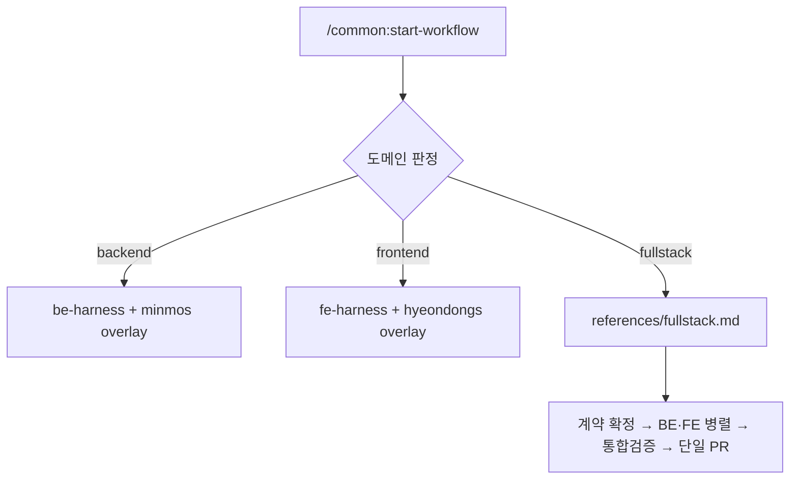
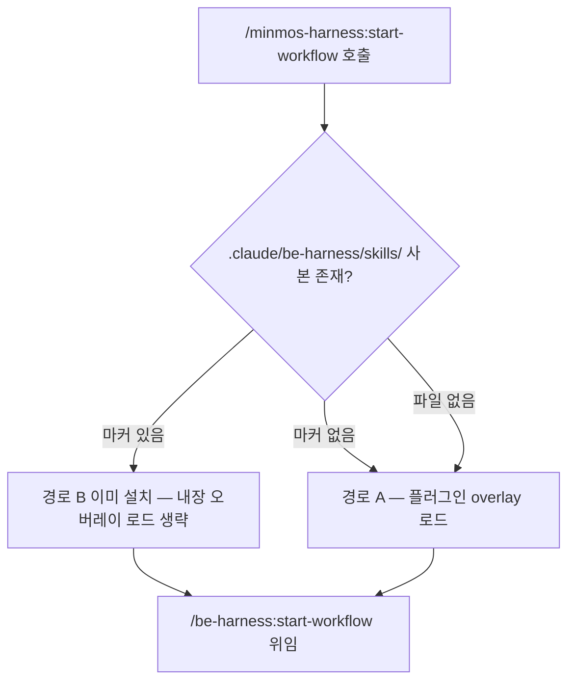
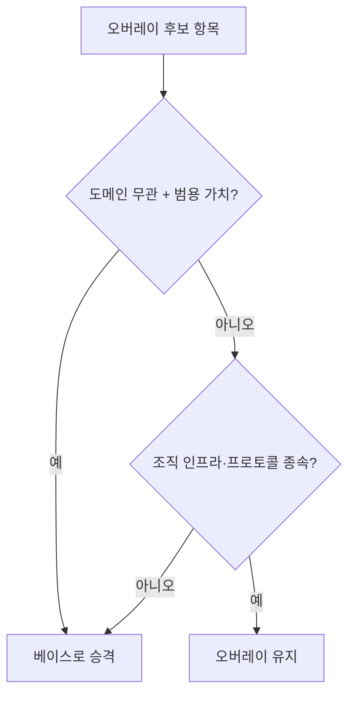

# PR #6 변경 요약 — 베이스+오버레이 2층 구조로 하네스 재편

- **PR**: #6 「Refactor: 베이스+오버레이 2층 구조로 하네스 재편」
- **브랜치**: `main` ← `refactor/harness-consolidation`
- **변경**: +2,431 / −5,560, 파일 102개 (문서·스킬 정의만, 실행 코드 없음)
- **버전**: common v0.9.0 · be/fe v1.0.0 · minmos v2.0.0 · hyeondongs v3.0.0

## TL;DR

1. **fs-harness 삭제** — 풀스택 절차를 `common:start-workflow` 안으로 흡수.
2. **common 라우터 12종 삭제** — 워크플로우 진입점을 `start-workflow` 하나로 통합, 도메인 판정 오케스트레이터로 승격.
3. **minmos·hyeondongs 를 오버레이로 전환** — 절차 복제를 없애고 `overlay/` 델타만 보유. `-mm`·`-hd` 접미사 14종 제거.
4. **기능 후퇴 방지 3건 승격** — minmos 가 베이스보다 앞서 있던 절차를 be/fe 로 올림.
5. 스킬 **55개 → 41개**.

---

## 왜 바꿨는가

### 절차가 6곳에 복제되어 있었다

| 파일 | 줄수 |
|------|------|
| `be-harness/skills/start-workflow` | 472 |
| `fe-harness/skills/start-workflow` | 357 |
| `minmos/skills/start-workflow-mm` | 496 |
| `fs-harness/skills/start-workflow` | 321 |
| `minmos/skills/start-workflow-fs` | 319 |
| `hyeondongs/skills/start-workflow-fs` | 319 |

뒤의 두 파일은 **바이트 단위로 동일한 사본**이었다. 베이스에서 Phase 하나를 고치면 5곳을 따라 고쳐야 했다.

### 스킬 목록이 이름 충돌로 잠식됐다

`e2e-test` 라는 이름의 스킬이 세션에 5개 존재했다. common 라우터 13종은 위임만 하면서 목록의 절반을 차지했고, `-mm`(11종)·`-hd`(3종) 접미사는 순전히 충돌 회피용이었다.

### 역전 현상

특화 하네스가 베이스보다 발전한 항목이 있었다. 그대로 삭제하면 기능이 후퇴한다.

---

## Before / After

### 플러그인 관계

```text
[Before]
common (라우터 13종) ─┬→ be-harness
                      ├→ fe-harness
                      ├→ fs-harness ──→ be + fe
                      ├→ minmos-harness (절차 전체 복제 + -mm 11종)
                      └→ hyeondongs-harness (fs 복제본)
```

```text
[After]
common (start-workflow 1개) ─┬→ be-harness ◄── minmos-harness (overlay/)
                             ├→ fe-harness ◄── hyeondongs-harness (overlay/)
                             └→ 풀스택 (자체 references/)
```

### 진입 경로



판정은 **항상 사용자 확인을 거친다.** 워크플로우가 장시간 자율 실행되므로 신호만으로 조용히 실행하지 않는다.

---

## 핵심 설계 결정

| 결정 | 이유 |
|------|------|
| 오버레이 위치를 **앵커**로 지정 | 절대 Phase 번호를 쓰면 베이스가 Phase 를 추가할 때마다 깨진다 |
| 앵커 매칭은 Phase **제목** 기준 | 번호가 밀려도 제목이 같으면 같은 위치 |
| 삽입 단계 표기는 `Phase N+` | 베이스 번호와 충돌하지 않음 |
| 앵커 소실 시 **해당 항목만 SKIP** | 베이스는 오버레이 없이도 완결적으로 동작해야 한다 |
| 오버레이 적용 경로 **A·B 동시 지원** | 위임 스킬 경로와 프로젝트 복사 경로의 용도가 다르다 |
| 중복 적용은 **소스 마커**로 차단 | `<!-- overlay-source: {plugin}@{ver} -->` 유무로 판정 |
| 범용 기능은 **베이스로 승격** | 오버레이가 베이스보다 나은 범용 절차를 가지면 그건 베이스의 결함 |

### 앵커 표기 예

```markdown
| 앵커                       | 위치 | 삽입 단계           |
| `Phase 1 (작업 범위 수집)`  | 직후 | E2E 메인 플로우 수집 |
| `Phase 8 (품질 루프)`       | 직후 | Codex 품질 리뷰     |
| `Phase 9 (API 문서 동기화)` | 치환 | Apidog 동기화       |
```

실행 시 `Phase 8 → Phase 8+ → Phase 9` 로 전개된다.

---

## 핵심 흐름

### 오버레이 적용 판정



마커 없는 사본은 **사용자가 직접 쓴 오버라이드**로 보고 함께 적용한다. 중복이 아니다.

### 승격 판정 기준



---

## Edge Cases

```
✅ 앵커 제목 소실        → SKIPPED:ANCHOR_NOT_FOUND, 베이스는 정상 완주
✅ 경로 A + B 동시 존재  → 마커 확인 후 A 로드 생략 (이중 적용 차단)
✅ 마커 없는 사용자 파일  → 오버레이와 함께 적용 (덮어쓰지 않음)
✅ 베이스 플러그인 미설치 → 위임 스킬이 설치 안내 후 종료
✅ 풀스택인데 한쪽만 설치 → 단일 도메인 진행 제안 후 종료
✅ be/fe 가 풀스택 감지  → /common:start-workflow --fs 로 자체 전환
✅ --fs 로 재진입        → Step 1 에서 플래그 감지, 판정 생략 (재귀 없음)
⚠ 오버레이 런타임 동작   → 미검증 (아래 Follow-up)
```

---

## 레이어별 변경

### common — 진입점 통합

| 항목 | 변경 |
|------|------|
| 라우터 12종 | 삭제 (`request`·`e2e-test`·`doctor`·`init` 등) |
| `ROUTING.md` | 삭제 — 라우터가 1개만 남아 규약 문서 불필요 |
| `start-workflow` | 라우터 → **도메인 판정 오케스트레이터** |
| `references/` | 신설 — `fullstack.md` + 계약 템플릿 · TDD · 에이전트 프롬프트 |
| 유지 | commit 계열 4종 · merge · doc-gen · how-to-use · submit-feedback |

### be-harness / fe-harness — 베이스 강화

| 승격 항목 | Before | After |
|----------|--------|-------|
| simplify-loop | be 37줄 (빌트인 `/simplify` 반복) | 155줄 — 4관점 리뷰 + Devil's Advocate + Arbiter, be·fe 양쪽 |
| e2e-test-loop | be 64줄 | 202줄 — 정직한 자기 점검 HTML 리포트, probe 를 profile 기반으로 일반화 |
| Implementation Notes | minmos 전용 | be·fe 승격 — SKILL · templates · agent-prompts 3곳 |

profile 에 `reportDir` 필드 추가 (기본 `.claude/harness-reports`).

### minmos-harness — 오버레이 전환

```text
[삭제] start-workflow-mm · request-mm · convention-check-mm
       default-conventions-mm · e2e-test-mm · e2e-test-loop-mm · simplify-loop-mm

[이관] Post-Math 특화 절차 → overlay/references/
       gRPC · DB 안전 · status code · E2E 리포트 · 컨벤션 · Codex 리뷰

[신설] overlay/ 7종 + skills/start-workflow (위임, 44줄)

[개명] minmo-init-mm → init | minmo-doctor-mm → doctor
       apidog-schema-gen-mm → apidog-schema-gen | pagenation-mm → pagenation ...
```

`init` 에 오버레이 경로 B 설치 단계, `doctor` 에 오버레이 적용 상태 점검을 추가했다.

### hyeondongs-harness

`overlay/` 2종 + 위임 스킬 신설, `-hd` 접미사 제거, `start-workflow-fs` 삭제.

### 문서

`docs/overlay.md` 신설 (오버레이 규약 canonical), `skill-authoring.md` §9 에 오버레이 절 추가, be/fe `OVERRIDES.md` 에 경로 B 규약 문서화.

---

## 테스트 / 검증

실행 코드가 없는 문서 레포이므로 정적 정합성 검사로 대체했다.

| 항목 | 결과 |
|------|------|
| `fs-harness` 잔존 참조 | 0건 |
| 삭제된 common 라우터 참조 | 0건 |
| `ROUTING.md` 참조 | 0건 |
| 깨진 `references` 링크 | 0건 |
| frontmatter `name` ↔ 디렉토리명 | 41/41 일치 |
| SKILL.md 500줄 상한 | 전부 통과 |

**미검증**: 오버레이 메커니즘의 런타임 동작. Codex 플랜 리뷰는 30분 idle 타임아웃으로 결과를 받지 못했다.

---

## Rejected Decisions

| 기각 항목 | 사유 |
|----------|------|
| 위임 스킬 없이 경로 B(init 복사)만 지원 | 사용자가 "둘 다 지원" 명시 선택. common 이 타 플러그인 파일 경로를 참조할 수 없어(`skill-authoring` §9) 경로 A 용 위임 스킬이 구조적으로 필요 |
| be ↔ fe 동명 스킬 통합 (`request`·`e2e-test`·`doctor` 등) | 도메인이 근본적으로 다름. 통합 시 단일 스킬이 두 도메인 분기를 모두 안게 되어 복잡도 증가. 플러그인 네임스페이스로 이미 구분됨 |
| 풀스택 기능 완전 폐기 | 화면+API 동시 변경 작업을 사용자가 두 번 나눠 돌려야 함. 계약 고정·교차 검증이 사라져 API 불일치 위험 |
| e2e-test 전체를 베이스로 승격 | gRPC/PubSub 은 be-harness 가 전제하지 않는 스택. 오버레이 references 로 보존 |

---

## Follow-up 후보

| 항목 | 우선순위 |
|------|---------|
| 실제 프로젝트에서 `/minmos-harness:start-workflow` 1회 실행 — 앵커 매칭·중복 차단 런타임 검증 | P0 |
| Codex 플랜 리뷰 재시도 (MCP idle timeout 상향 후) | P1 |
| `{STATE_FILE}` 세션별 격리 — 동시 세션 충돌 가능성 (기존 후속 과제) | P2 |
| `init`/`doctor` 4중복 정리 검토 — 현재는 환경이 실제로 달라 유지 | P2 |
