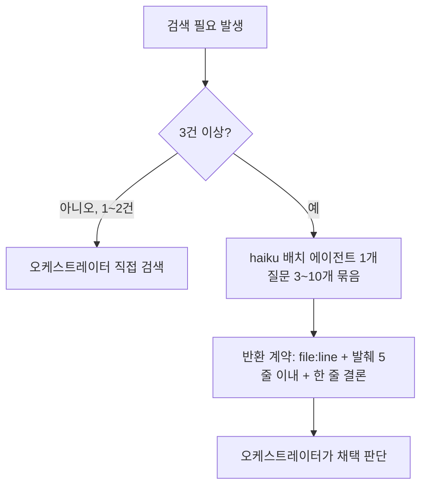
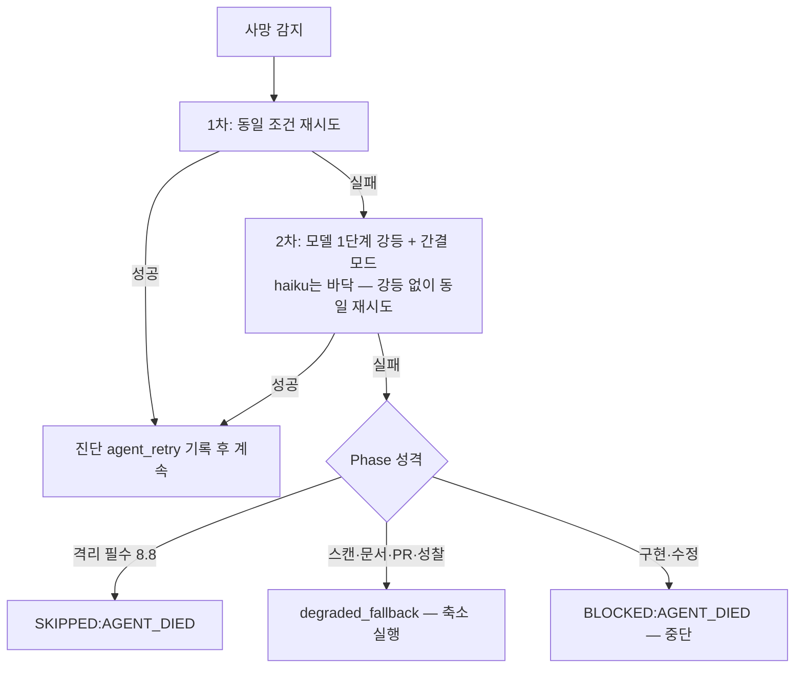

# PR #8 — start-workflow 토큰 소비 튜닝 (be-harness v1.1.0)

> **문서 목적**: PR #8의 변경 사항을 리뷰 관점에서 요약한다.
> `main` ← `feat/start-workflow-token-tuning` · **+140 / -62 · 5개 파일** · 커밋 `a8d633c`

---

## 1. 왜 바꿨는가

`start-workflow` 1회 실행의 토큰 소비가 과도했다. 실측 분석에서 확인된 병목은 4가지다.

- **오케스트레이터 컨텍스트 오염** — 검색을 직접 수행해 결과 전문이 메인 컨텍스트에 누적
- **에이전트 부팅 고정비** — 에이전트 1개당 시스템 프롬프트·스킬 로드로 약 55K 토큰 소모
- **전 Phase 상시 실행** — 매회 필요하지 않은 성찰(Phase 11)까지 무조건 실행
- **단일 모델 티어** — 단순 탐색·수집 작업에도 판단 작업과 동일한 상위 모델 사용

튜닝의 대원칙: **검출력 보존**. 검증·리뷰의 *판정* 품질을 깎는 절감은 하지 않는다.

---

## 2. Before / After

```text
[Before]
모든 에이전트가 동일 등급표 모델 사용
→ 오케스트레이터가 검색 직접 수행 (결과 전문 누적)
→ 8.2 simplify / 8.3 convention 각각 별도 에이전트 (부팅 2회)
→ Phase 11 성찰 매회 실행
→ 에이전트 사망 시 처리 규정 없음 (임기응변)
```

```text
[After]
작업 성격 3분류 티어링 (탐색 haiku / 이해 sonnet / 판단 등급표)
→ 3건+ 검색은 haiku 배치 에이전트에 위임 (발췌 5줄 반환 계약)
→ 8.2+8.3 통합 스캐너 1에이전트 (부팅 1회)
→ Phase 11은 --reflect opt-in
→ 사망 처리 공통 규약 (재시도 → 강등 → Phase 성격별 폴백)
```

---

## 3. 핵심 설계 결정

| 결정 | 이유 |
|------|------|
| 작업 성격 3분류를 등급표보다 먼저 적용 | 모델 단가 절감 — 단, 검증 **판정**은 강등 금지 명문화로 검출력 보존 |
| 탐색 위임은 배치 필수 (1질문 1에이전트 금지) | 부팅 고정비 ~55K를 질문 3~10개로 상각 |
| '없음' 답변에 검색 패턴·경로 명시 필수 | 미탐("있는데 없다") 오류의 비대칭 비용 방어 — 검증 가능성 확보 |
| 8.2+8.3은 실행만 통합, ID·상태 갱신은 개별 유지 | minmos-harness overlay 앵커 `(Phase 8.3)` 무손상 |
| 사망 처리에 신규 상태 코드 미도입 | `docs/skill-authoring.md` §5 표준 집합 유지 — `agent_retry`·`degraded_fallback`은 표 셀 안의 진단 데이터 |
| Phase 12 실행 절차를 templates.md로 이동 | SKILL.md 500줄 하드캡 준수 (최종 499줄) |

---

## 4. 핵심 흐름

### 4.1 탐색 위임



예외: plan을 좌우하는 부재 확인은 sonnet 이상 또는 직접 검색.

### 4.2 에이전트 사망 처리



축소 실행 기준: 산출물 **형식 유지** + 범위를 **변경 파일 한정**. 모든 축소는 보고서 §9 "축소 실행 내역"에 재실행 권장과 함께 고지.

---

## 5. Edge Cases

```
✅ haiku 강등 바닥 → 강등 없이 동일 조건 재시도 (무한 강등 방지)
✅ 검증 판정(8.4/8.8)은 티어링 강등 금지 — 유일 예외는 사망 복구 2차, 반드시 §9에 고지
✅ 탐색 '없음' 답변 → 검색한 패턴·경로 명시 필수 (미탐 검증 가능)
✅ 세션 한계로 사망 2회 누적 → 비검증 Phase를 SKIPPED:BUDGET_PRESERVED로 양보, 8.4/8.8 위임은 유지
✅ --reflect 미지정 → 상태 파일 생성 시점에 Phase 11 = SKIPPED:REFLECT_NOT_REQUESTED, Remaining Phases 제외
✅ Phase 12 보완점 질문 → Phase 11이 DONE일 때만 — SKIPPED:*면 실제 상태 코드 기준 분기 문구로 고지
⚠ Codex 사망은 본 규약 대상 외 → 기존 Phase 4.3 CODEX-UNAVAILABLE 경로 그대로
```

---

## 6. 레이어별 변경

| 파일 | 변경 내용 |
|------|----------|
| `skills/start-workflow/SKILL.md` (499줄) | `--reflect` 플래그, 작업 성격 3분류 표, 탐색 위임 규칙, 사망 처리 요약+포인터, Phase 11 조건부 전환, Phase 12 요약화, 진단 데이터 allow-list 분리. 상쇄 삭제: 중복 `--hard` 영향 표 |
| `references/agent-prompts.md` | **사망 처리 공통 규약 본문** (감지 → 재시도 표 → 종료 조건 표 → 축소 기준 → 고지), "남은 Phase" 치환 규칙 |
| `references/quality-loop.md` | 8.2+8.3 **통합 스캐너** 프롬프트 (상태 갱신은 오케스트레이터 몫 명시), 8.8 복원 sonnet/medium 고정 |
| `references/templates.md` | Phase Results 표 구조화 (Status + 진단 열 분리), **Phase 12 실행 절차** 수용, 보고서 §6 분기 문구·§9 축소 실행 내역 신설 |
| `.claude-plugin/plugin.json` | 버전 `1.0.0` → `1.1.0` |

---

## 7. 테스트 / 검증

- **Codex Code Reviewer advisory 루프 3회** — v1: Critical 4건+권고 2건 → v2: 잔존 3건+신규 2건 → v3: **APPROVE** (5/5 RESOLVED, 신규 이슈 0건). 지적 전건 반영, 기각 0건
- **SKILL.md 499줄** — §8 하드캡(500줄) 통과
- **overlay 앵커 검증** — "Phase 1/4/8/9" 제목·"(Phase 8.3)" 매핑 전부 해소 가능 확인
- **Codex 읽기 전용 준수** — 매 실행 후 `git status --porcelain`으로 working tree 불변 확인

---

## 8. Rejected Decisions

| 항목 | 기각 사유 |
|------|----------|
| 신규 상태 코드(예: `DEGRADED`) 도입 | §5 표준 집합 위반 — 진단 데이터(`degraded_fallback`)로 표현하는 방식 채택 |
| README.md 서술 동반 수정 | Phase 11/12 흐름 서술은 "실행될 때"의 설명으로 기능적으로 정확 — 수정 불요 판단 |
| minmos-harness 동반 버전 범프 | 변경 파일 없음 — 2.1.0 유지 |
| 8.8 복원을 haiku로 강등 | 이해·요약 분류지만 Diff 판정 재료 품질 확보를 위해 sonnet 고정 (확정된 결정) |

---

## 9. Follow-up 후보

- **글로벌 CLAUDE.md 슬리밍** — 저장소 외부 개인 파일, 남은 절감 레버 중 최대
- **유휴 캐시 TTL** — 사용 습관 영역 (도구로 강제 불가)
- **`--reflect` 주기 실행 리마인드** — 5~10회 주기 권장을 자동화할지 검토
- **튜닝 효과 실측** — 다음 워크플로우 실행에서 실제 토큰 소비 비교
