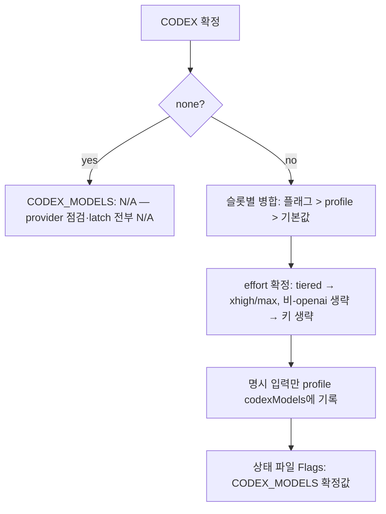
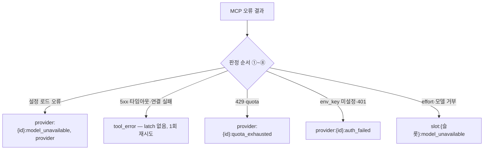
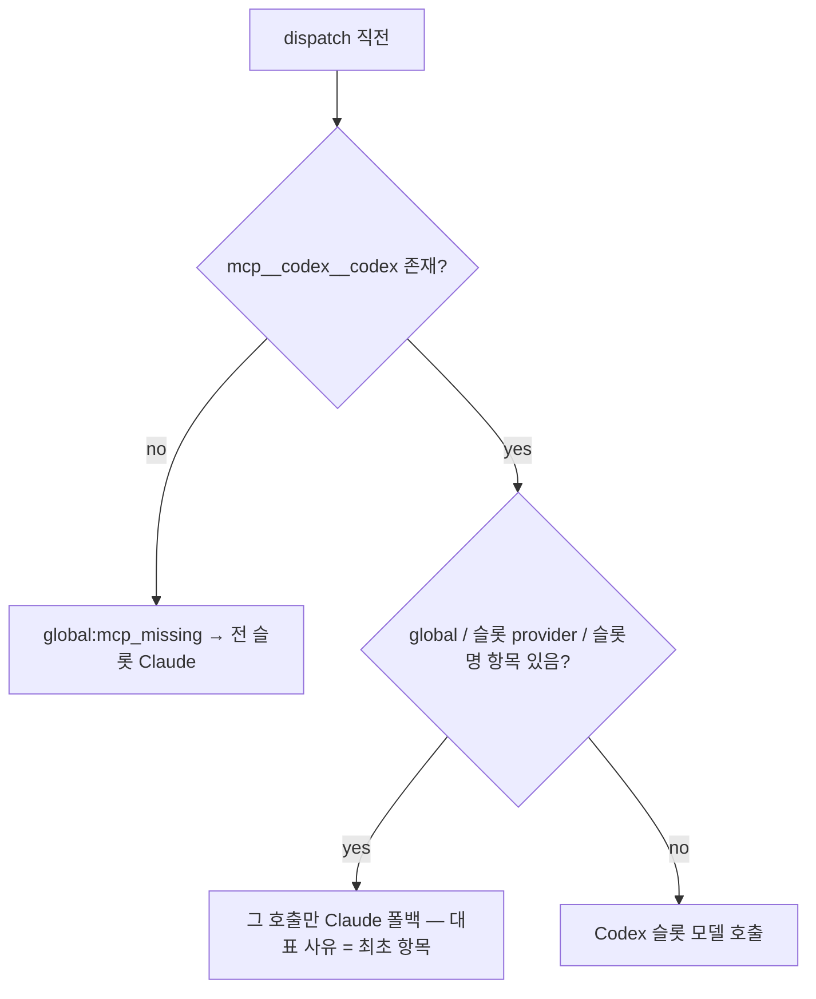
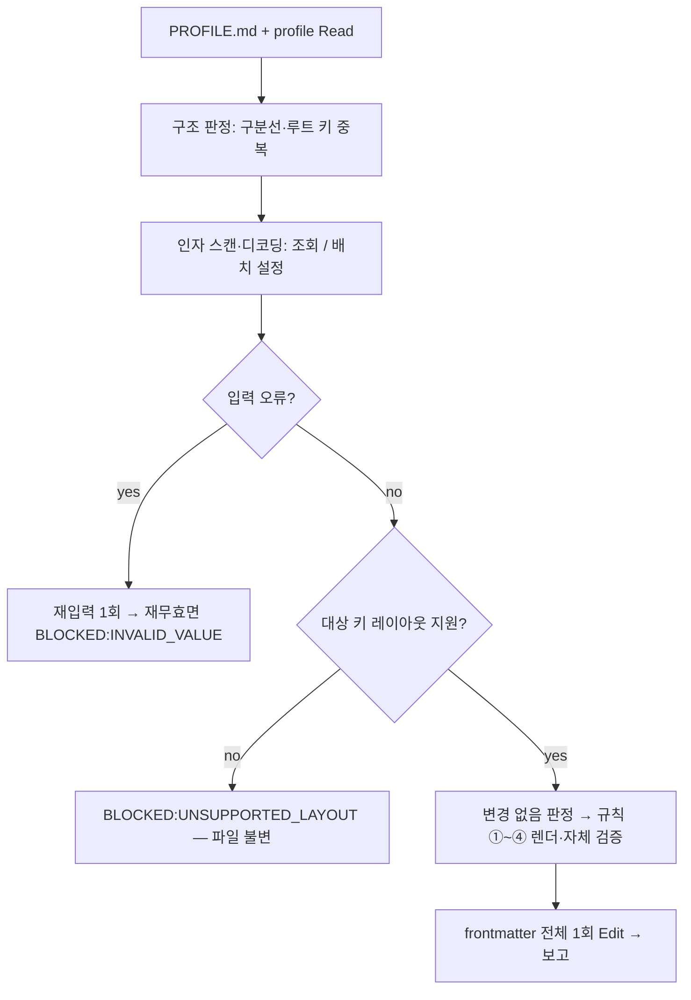

# PR #11 — Codex 위임 모델 슬롯화(codexModels) + config 스킬

> **문서 목적**: PR #11의 변경 사항을 리뷰 관점에서 요약한다.
> `main` ← `feat/codex-models` · **+836 / -180 · 40개 파일 · 커밋 10건** · base `0a0a66c`
> 버전: be-harness 1.3.0 → **1.5.0** · fe-harness 1.2.0 → **1.4.0** · common 0.12.0 → **0.13.0** · minmos-harness 2.3.0 → **2.4.0**

## 1. TL;DR

- Codex 위임 지점을 **4슬롯**(`review`·`explore`·`judge`·`write`)으로 분리하고, 슬롯마다 `{provider, model, effort?}`를 지정한다 — profile `codexModels` · `--codex-models` · `init`. GLM·Kimi 등 외부 provider 사용 가능, **키·URL은 `~/.codex/config.toml`에만**.
- 실패 정책을 **global · provider · slot 3계층 latch**로 재정의 — provider 하나의 인증 오류가 전체 위임을 죽이지 않는다.
- **`config` 스킬 신설**(be/fe) — profile 값 조회·배치 수정, 주석·키 순서·본문·EOL 보존, 비지원 레이아웃은 fail-closed.
- 가드 강화 — check-plugins §6 재설계(모델 리터럴 1곳 강제·존재 검사·잔재) + §7 PROFILE ↔ config 키 parity.

## 2. 왜 바꿨는가

- Codex 모델(luna/sol)이 문서 곳곳에 **리터럴로 고정** → 대체 모델을 쓸 수 없고, 교체 시 전수 수정.
- Codex 실패는 **실행 전체 latch** → provider 하나의 문제로 모든 슬롯이 Claude 폴백.
- profile 값 하나를 **보거나 바꾸는 경로가 없음** → `init` 전체 재질문 또는 손편집(`reportDir`·`e2eLockDir`은 손편집이 유일).

## 3. Before / After

```text
Before
codexMode: max
→ 읽기 = Codex luna / 쓰기 = Codex sol (리터럴 고정)
→ 실패 시 fallback({사유}) — 실행 전체 latch
→ profile 수정 = init 전체 재질문 or 손편집
```

```text
After
codexMode: max + codexModels: { review: {provider, model, effort}, … }
→ review / explore / judge / write 슬롯 라우팅 — sandbox는 슬롯에 고정
→ 실패 시 fallback(global:… | provider:{id}:… | slot:{슬롯}:…) — 범위별 latch
→ /be-harness:config {키}={값} … — frontmatter 1회 Edit, 주석·순서 보존
```

## 4. 핵심 설계 결정

| 결정 | 이유 |
|------|------|
| 슬롯 4개 고정, sandbox는 슬롯에 고정 | 모델·provider와 무관하게 쓰기 안전(§5) 유지 |
| provider 정의는 `~/.codex/config.toml`, profile에는 id만 | 키·URL·헤더의 profile 유입 차단 |
| OpenAI 모델 리터럴은 `codex-mode.md` defaults 마커 표 **1곳** | 모델 교체 = 1곳 수정, 가드가 잔재 0을 강제 |
| 병합 = 슬롯 레코드 단위(필드 상속 없음) | provider/model 교차 조합 사고 방지 |
| `tiered`는 `review` 전용, 전송 전 `xhigh`/`max`로 변환 | 벤더가 모르는 문자열 전송 금지 |
| 실패 latch 3계층 + 대표 사유 | 부분 폴백, 진단·minmos `SKIPPED:CODEX_*` 매핑 일관 |
| `config`는 조회·수정만, 생성은 `init` | 스킬 경계 고정(재론 차단) |
| 전건 preflight → frontmatter **1회 Edit** | 배치 원자성 — 부분 적용 없음 |
| 지원 레이아웃 밖은 `BLOCKED`(fail-closed) | 주석·구조 손실보다 거부 |
| PROFILE.md = 스키마 canonical + parity 가드 | 키 드리프트 방지, 개수 하드코딩 없음 |

## 5. 핵심 흐름

### 5.1 슬롯 resolve (Pre-flight)



### 5.2 실패 판정 → latch 범위



### 5.3 dispatch 시 latch 판정



### 5.4 config 수정



## 6. Edge Cases

```
✅ codexMode none → codexModels 전부 N/A (profile 값 무시, provider 점검 없음)
✅ 저장된 profile 슬롯 무효 → 그 슬롯만 기본값 + 경고, doctor INVALID_SLOT
✅ 플래그 일부 무효 → 플래그 전체 무효(원자적), 대화형 재입력 1회
✅ 재개 → 상태 파일 CODEX_MODELS 기준·플래그 무시, 구 상태 파일은 기본값 보완 기록
✅ 풀스택 → be 블록 → fe 블록 → 기본값(블록 단위), 기록은 writable be·fe 모두 — 블록 없는 대상은 resolve 블록 복사 후 적용
✅ 구 fallback({사유}) → 재개 시 global:{사유}로 1회 정규화
⚠ 결과 본문이 온 호출은 문구로 latch하지 않음 — 형식 검증만 (no_result / invalid_result)
⚠ 병렬 묶음의 latch 발생 순서 = dispatch 순서, (범위, 대상) 중복은 최초 1건
✅ config: 중립 주석 줄·꼬리 주석은 어떤 규칙도 변형하지 않음 — 주석 달린 줄 삭제가 필요하면 차단
✅ config: 플레이스홀더 `# codexModels:`는 선두 `# `만 제거해 활성화, 뒤따르는 예시 주석은 그대로
✅ config: CRLF·혼합 EOL 줄별 유지, 본문의 `---`는 구분선으로 보지 않음
⚠ config: 배열 원소 안의 쉼표 · 따옴표 없는 앞뒤 공백 · codexModels bare-unsafe 값은 비지원 (문서화된 한계 3건)
✅ fe 레거시 .hyeondong-config.json → 조회만, 수정은 BLOCKED:LEGACY_READONLY
```

## 7. 레이어별 변경

| 레이어 | 변경 | 파일 |
|------|------|------|
| 정본 계약 | §1 슬롯 라우팅·defaults 표, §2.1 `codexModels`, §3 provider 항상 명시, §7 3계층 latch·판정 순서·doctor 코드, §8 러너 포인터 | be `references/codex-mode.md`(171줄) → fe/common 사본 sync |
| 오케스트레이터 | `--codex-models`·Pre-flight resolve·Flags `CODEX_MODELS`·Phase 5 확정값·문구 슬롯화 | be/fe/common `start-workflow` SKILL, `fullstack.md`, references·templates |
| 오버레이 | `review` 슬롯·범위별 latch·대표 사유 → `SKIPPED:CODEX_*` | minmos `codex-review.md`, `overlay/start-workflow.md`(@2.4.0) |
| 설정 | PROFILE `codexModels` 예시·"Codex provider 설정" 절, init 질문·템플릿, doctor `Codex providers` 점검 | be/fe PROFILE·init·doctor, minmos doctor |
| 신규 스킬 | config — 조회·배치 수정·레이아웃 매트릭스·상태 코드 | be/fe `skills/config/SKILL.md`(200/206줄) |
| 가드 | §6 재설계, §7 parity | `scripts/check-plugins.sh` |
| 문서·버전 | README ×4, plugin.json ×4 | — |

## 8. 테스트 / 검증

- 정적: `check-plugins: OK` · `sync-codex-mode --check: OK` · SKILL ≤500(be start-workflow 495) · codex-mode.md ≤180 — codexModels만 적용된 중간 커밋 상태에서도 동일하게 통과.
- codexModels negative test (Codex CLI 0.149.1, 키 불필요): 미정의 provider → `model_unavailable(provider)` / `env_key` 미설정 → `auth_failed` / openai 기본 슬롯 정상 응답 / 미지원 모델 400 → slot latch.
- config: 규칙 sanity check(스크래치 참조 구현, 비배포) — 스캐너·렌더·불변 조건 전 시나리오 통과 / Claude 리뷰 에이전트 + Codex Code Reviewer 3회차 APPROVE.
- Plan 검증 루프: codexModels 5회(v1→v7) PROCEED · config 5회(v1→v6) PROCEED.
- **미검증**: 외부 provider 실키 end-to-end 호출(키 없음) · `claude plugin eval` 실행 검증.

## 9. Rejected Decisions

| 기각 | 사유 |
|------|------|
| 슬롯별 `config` 패스스루(컨텍스트 창 등) | 3필드 스키마 고정 — 메타데이터는 Codex `model_catalog_json` 유저 설정 |
| openai 축약형(`review=gpt-x`) | provider 항상 명시 — 파싱 모호성 제거 |
| 슬롯 교차 병합(필드 상속) | 레코드 단위 채택이 결정적 |
| 인라인 provider(profile에 URL·키) | 시크릿 유입 차단 |
| 작업 단위 실패를 `SKIPPED:CODEX_UNAVAILABLE`로 매핑 | 상태 코드 의미 불변 — 진단 `codex_fallback`만 |
| config `--unset`·단독 `codexModels=default` | §2.1 문법 밖 — 슬롯별 `=default`로 충분 |
| config 주석 승격·자동 삭제 | 주석 의미가 바뀔 수 있음 — 주석 달린 줄 삭제는 차단 |
| codexModels 저장 형태 따옴표화 | §2.1 공유 형태 유지 — bare-unsafe 값 거부로 대체 |
| minmos/hyeondongs `config` 위임 스킬 | 오버레이 델타 없음 |
| parity 가드 키 개수 하드코딩 | 양방향 집합 동일성이 보장 |

## 10. Follow-up 후보

- fe `init`의 기존 파일 병합 규칙 부재(be만 "변경 필드만 Edit").
- `claude plugin eval` 기반 config 실행 검증.
- codex-mode.md §2.1이 bare-unsafe model 값(`null`·숫자)을 허용 — init/플래그 경로로 profile 오염 가능(상류 결함, config는 거부).
- 외부 provider 실키 실측 — 비-OpenAI의 `model_reasoning_effort` 수용 여부.
